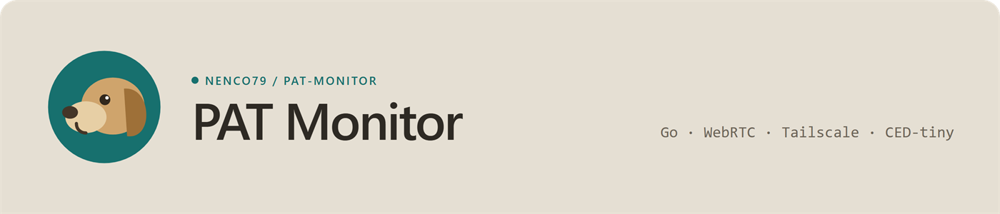
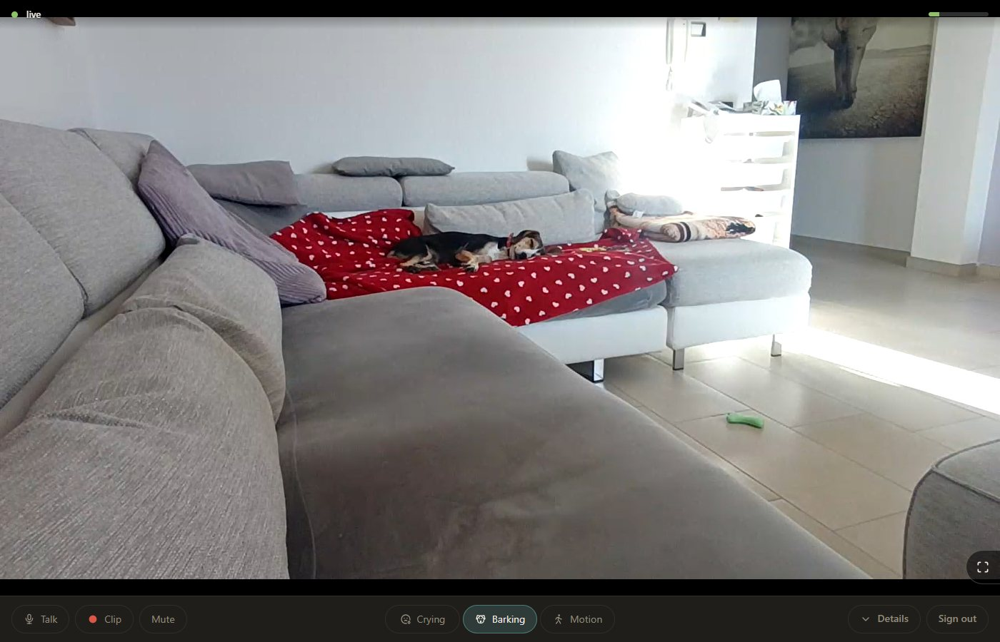
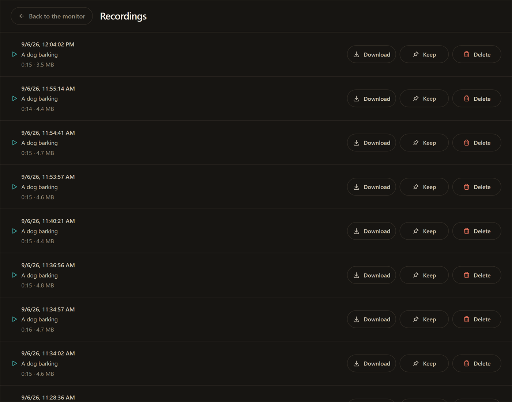
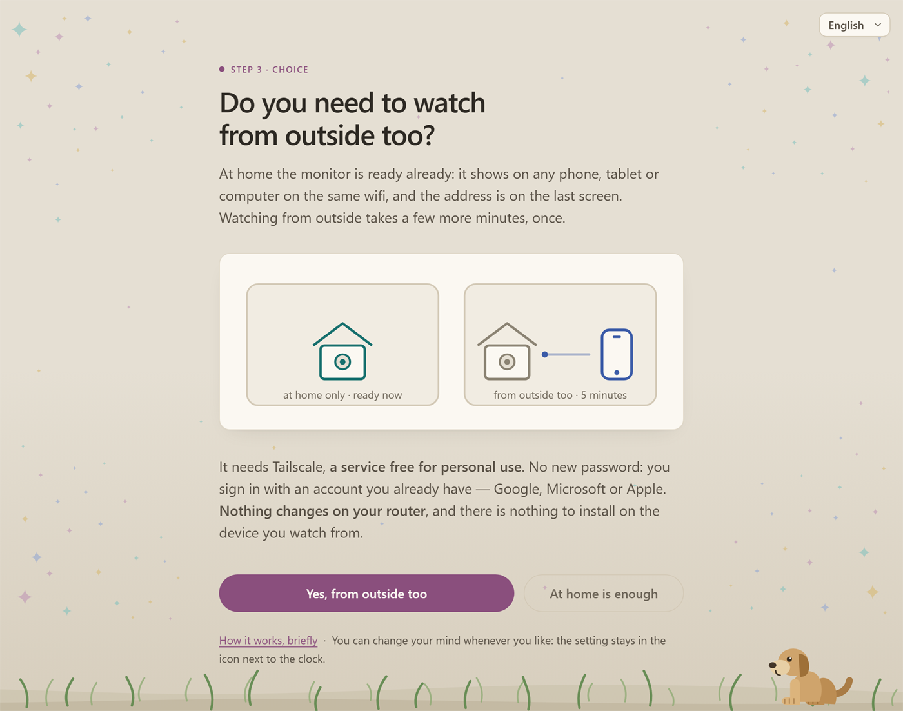
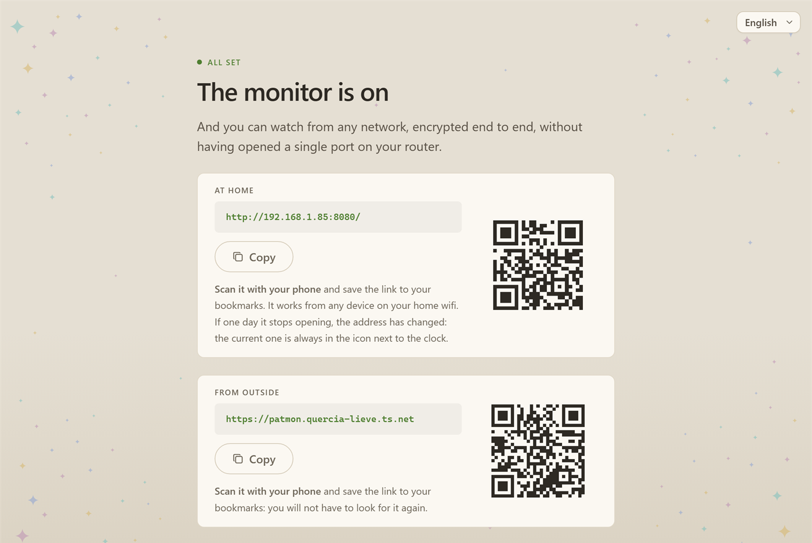

<p align="center">
  
</p>

# PAT Monitor

A pet and baby monitor. It captures the webcam and the microphone,
encodes them with the machine's hardware encoder, and streams them to a browser
over WebRTC, at home or from anywhere, without opening a port on the router.

The whole program is a single executable with no external dependencies. It runs
on Windows: video comes from Media Foundation, audio from WASAPI with an
embedded Opus encoder, and remote access from an embedded Tailscale node. The
name stands for *Pet And Toddler*.

<!-- The screenshots are English because the browser that took them asked for
     English: the interface follows the browser. They are pictures, so nothing
     here can check them against the pages they claim to show -- when a page
     changes, these go stale in silence. images/ says which build each came
     from, and which of them was photographed rather than driven. -->
<p align="center">
  
</p>

## Features

- **Live video and audio in a browser.** H.264 and Opus over WebRTC. Any number
  of viewers share a single encode.
- **Adaptive quality.** The bitrate tracks a target quantizer inside the ceiling
  the network allows; below that, the resolution steps down; below the last
  resolution step, the frame rate steps down to 5 and then 2 fps. Audio always
  stays at full quality. Measured on Intel Quick Sync, on AMD, on NVIDIA and on
  the Microsoft software encoder.
- **Remote access without router configuration.** An embedded Tailscale node
  publishes the signalling over HTTPS with a valid certificate through Funnel.
  The audio and video then travel directly between the two devices.
- **Password protection**, with sessions, a rate limiter on failed logins, and
  the Funnel refusing to start until a password exists.
- **Guided setup** in the browser, opened automatically on first run. Four
  screens for home-only use, six if remote access is wanted, showing live device
  and tunnel status at each step.
- **Tray icon** whose colour reports the state, and a panel on right-click
  drawn to match the pages: the address as a QR code to point a phone at, the
  pending action if there is one, the guided setup, the video and log folders,
  disconnect-all-devices, a forgotten-password reset, and quit.
- **Detection**: motion, a baby crying, a dog barking, each with its own
  switch. An event raises a band and a chime on the open page, and is written to
  the log. Sound is recognised by CED-tiny, a 527-class audio tagger that runs
  on the CPU inside the binary — no download, no GPU, nothing to install — woken
  by a shape detector, so at rest it does not run at all. The classes and the
  thresholds were measured on three public datasets and are in
  `baselines/sounds.txt`.
- **Event clips.** Every detected event is written to disk: four to six
  seconds before it and ten after. The **Clip** button records one on demand out
  of the same pre-roll, and what it writes is exempt from retention. `/clips`
  lists them, plays them back, downloads and deletes them, and a per-clip lock
  exempts or releases the others. Retention is a disk quota plus an age.
- **Camera and microphone are chosen from the page.** The details panel lists
  the webcams and the microphones the machine has; choosing one reopens that
  capture without restarting anything, and a line beside the box says which
  device is really being used when the chosen one is not connected.
- **Talk-back.** Press the button and your voice comes out of the PC speakers.
  Half duplex: while you speak the monitor stops sending the room, so the
  microphone cannot pick up the speakers. One person talks at a time.
- **Diagnostics**: rotating log file, per-session viewer log with ICE path and
  packet loss, and standalone measurement tools.

The interface takes its language from the browser — English, Italian, German,
French, Spanish or Simplified Chinese, English being what everything else falls
back to — with a selector in the top right corner for when the browser gets it
wrong. Traditional Chinese is not there: a browser asking for `zh-TW` gets the
Simplified catalogue.

<p align="center">
  
</p>

## Requirements

- Windows 10 or 11, x64.
- A webcam and a microphone. Either one can be missing or fail without stopping
  the other.
- An H.264 encoder, which every supported Windows has: the machine's hardware
  one where there is one, the Microsoft software encoder otherwise. Which it is
  is not chosen by vendor, and `pat-diag` lists what the machine offers.
- A free Tailscale account, only for access from outside the house. Sign-in uses
  an existing Google, Microsoft or Apple account, and nothing has to be
  installed on the viewing phone.

## Getting started

1. Download the zip from
   [Releases](https://github.com/Nenco79/PAT-Monitor/releases), unpack it
   anywhere, and run `pat-monitor.exe`. The binary is unsigned, so SmartScreen
   shows a warning: choose **More info** and then **Run anyway**.
2. The guided setup opens at `http://localhost:8080/onboarding`. It asks for a
   password, shows the camera and the microphone level so they can be checked,
   and then offers remote access.
3. The final screen gives the address to open on a phone and a QR code for it.

<p align="center">
  
</p>

<p align="center">
  
</p>

The program then runs in the notification area. Left-clicking the icon opens the
monitor; right-clicking opens a panel with the QR code, the state and the
commands — among them quitting, which is what releases the camera and the
microphone.

**Start it from the console of that machine, not from inside a Remote Desktop
session.** Windows audio endpoints are per-session: in an RDP session the
microphone does not exist and talk-back cannot open, while the camera works, so
it looks like a microphone fault. Disconnecting does not fix it — the process
does not change session — so a monitor started that way stays deaf for as long
as it runs. It says so in the log and keeps the video going.

## Configuration

Config file and logs live in `%APPDATA%\PAT Monitor\`. The file is YAML and is
written by the setup, so editing it by hand is optional.

| key | default | meaning |
|---|---|---|
| `listen_addr` | `:8080` | local listening address |
| `quality` | `high` | video preset: `high` 720p30 2500 kbit/s, `medium` 540p30 1200, `low` 360p15 500 |
| `target_qp` | `30` | target quantizer for the saving loop, `0` disables it |
| `camera_device_id` | first usable | camera to use, by the symbolic link `pat-diag` prints |
| `mic_device_id` | system default | microphone to use |
| `mic_gain_db` | `0` | extra gain applied to the capture |
| `speaker_device_id` | system default | audio output used for talk-back |
| `prefer_encoder` | measured | force a specific H.264 encoder |
| `session_ttl_hours` | `168` | how long a login lasts |
| `stun_servers` | Google, Cloudflare | STUN servers for both ends |
| `update_check` | `true` | ask GitHub once a day whether a newer release exists |
| `funnel_enabled` | `false` | publish on the Internet through Tailscale |
| `funnel_hostname` | `patmon-` plus a per-machine fingerprint | node name in the tailnet |
| `tailscale_auth_key` | empty | pre-authorise the node instead of approving it from the browser |
| `detect_cry`, `detect_bark`, `detect_motion` | `true` | which events to look and listen for |
| `clips_max_mb` | `1000` | disk quota for the event clips, `0` means no limit |
| `clips_max_days` | `14` | how long a clip is kept, `0` means no expiry |

That is every key. The file also holds `password_hash`, an argon2id hash, and
`onboarding_done`: state the setup writes, not settings. `camera_name` is the
superseded way of choosing the camera, read only when `camera_device_id` is
empty: a name is shared by two cameras of the same model.

**If the chosen camera is not connected the monitor opens the first usable one
and says so**, with a warning in the log and an alert on the page: the picture
may be of another room, and that is the one thing you cannot tell by looking at
it.

Command line:

| flag | effect |
|---|---|
| `-config PATH` | use a different configuration file |
| `-listen ADDR` | override the listening address |
| `-set-password` | set the password and exit |
| `-show-config` | print the active configuration and exit |
| `-version` | print the version and exit |
| `-v` | debug logging |
| `-audio-test-tone` | replace the microphone with a generated tone |
| `-bitrate N` | pin the video bitrate, for diagnostics |
| `-simulate-fault CODES` | alternate the given faults every twenty seconds, to exercise the alerts |
| `-simulate-panic WHERE` | raise a deliberate panic in `video`, `audio`, `accessory` or `now`, to exercise the recovery |
| `-pprof ADDR` | enable pprof on a loopback address |

## Updates

Once a day the monitor asks GitHub whether a newer release exists. If there is
one, the notification area says so — a balloon the first time, then a row in the
panel that opens the release page — and the log records it. Nothing is
downloaded and nothing is replaced: updating means fetching the new zip and
unpacking it over the old one, with the monitor closed.

Releases marked *pre-release* on GitHub are never reported.

What leaves the house is one request a day carrying this machine's address and
the version it is running — nothing about the configuration, the tailnet or who
is watching. `update_check: false` stops it, and then the monitor speaks to
nobody.

Each release is a zip holding the binary, `LICENSE`, `NOTICE` and `licenses/`,
plus a detached signature made with a key that is not on GitHub. Nothing checks
that signature yet: it ships now so that a later version can.

## How remote access works

The Tailscale node runs inside the process, so Tailscale does not have to be
installed on the machine. Funnel gives the monitor a public HTTPS address with a
real certificate, which serves the page and the WebRTC signalling. Audio and
video do not go through it: ICE opens a direct path between the monitor and the
phone. If that path cannot be established, for instance on a network that
blocks UDP, the connection fails: there is no relay to fall back to. The
remedy for such a network is Tailscale on the device you watch from, which
relays on its own when a direct path is not available.

## Building

Go 1.26 or newer and PowerShell. No CGo, no C compiler.

```powershell
$env:CGO_ENABLED = '0'
.\build.ps1              # what ships: no console, stripped
.\build.ps1 -Console     # the same monitor with a console, plus the tools
go vet ./... ; go test ./...
```

With no flag the build produces the program as it is delivered: no console, the
tray icon its only presence.

`build.ps1` rather than `go build`: the build stamps the version and the
Tailscale node version through the linker, and generates the executable's icon
resource.

`.\build.ps1 -Release` makes what gets published. It refuses a tree with
uncommitted changes, regenerates `licenses/`, and leaves
`dist\PAT-Monitor-<version>-windows-amd64.zip` — the binary, `LICENSE`,
`NOTICE` and `licenses/` inside one folder — with a detached `.sig` beside it.
Uploading the two to a GitHub release is a separate step, done by hand.

The signature needs a signing key, and a fork needs its own. `go run
./cmd/pat-sign -generate -key release.key` writes the private half and prints
the public one to paste into `internal/update/pubkey.go`; `build.ps1` reads the
private half from `-Key` or from `PATMON_SIGNING_KEY` and will not build a
release without it. Keep it out of the repository — `*.key` is in
`.gitignore` — and back it up: a lost key cannot be replaced for installations
that already exist.

Pushing a `v*` tag builds the archive on GitHub with `-Release -Unsigned` and
leaves the release a **draft**: the signature is made where the key is, over the
bytes that build produced, and uploaded beside the zip before publishing. The
key is deliberately not a repository secret — it exists to survive this account,
so a workflow that could reach it would prove the opposite of what it signs.

## Diagnostic tools

`build.ps1 -Console` puts the measurement tools in `bin/` next to the monitor;
which ones is `build.ps1`'s business. The default build skips them.

| tool | what it reports |
|---|---|
| `pat-diag` | Direct3D device, available H.264 encoders, camera formats and streams, microphone |
| `pat-capture` | the full pipeline: delivery regularity, bitrate, quantizer distribution, keyframes |
| `pat-viewer` | a synthetic WebRTC viewer, with on-demand keyframe requests |
| `pat-wasapi` | the three microphone paths — shared, raw, exclusive — one after the other; `-out` checks the talk-back output by listening to what the speakers play |
| `pat-opus` | the audio encoder, checked against an independent decoder |
| `pat-sounds` | the sound recognition on labelled datasets: which classes to watch, at what threshold, and what the shape detector lets through |

Three more are run from source: `go run ./cmd/pat-licenses` regenerates
`licenses/`, `go run ./cmd/pat-icon` writes the icon resource, which the build
already does, and `go run ./cmd/pat-sign` makes the release signing key and
signs an archive with it, which `build.ps1 -Release` calls.

## Source layout

| package | contents |
|---|---|
| `cmd/pat-monitor` | the program, flags, wiring |
| `internal/mf`, `internal/media` | Media Foundation capture and H.264 encoding, SPS and QP parsing, fMP4 muxer |
| `internal/audio`, `internal/audiocodec`, `internal/resample` | WASAPI capture, Opus encoding, and the rate conversion the analysis stream needs |
| `internal/pipeline` | capture supervision, restart, resolution and cadence changes |
| `internal/rtc` | WebRTC hub, congestion control, bitrate, resolution scale, quality loop |
| `internal/server` | HTTP, authentication, signalling, web pages, session log |
| `internal/tunnel` | Tailscale node and Funnel |
| `internal/tray` | notification area icon and the panel behind it |
| `internal/qr`, `internal/icon` | QR encoder and Windows icon writer |
| `internal/wincom` | the reading of what `CoInitializeEx` returns |
| `internal/opuswasm` | libopus in WebAssembly, one module per codec |
| `internal/detect`, `internal/alerts` | motion, cry and bark detection, and the set of what is wrong right now |
| `internal/ced`, `internal/gguf` | the sound recogniser that names what it heard, and the reader for the model file it runs |
| `internal/guard` | a panic turned into a fault of the part it happened in, so the camera does not go off for it |
| `internal/record` | the seconds before an event, kept in memory, and the clips written from them |
| `internal/i18n` | language catalogues, with English as what the others fall back to |
| `internal/encoder`, `internal/devices` | quality presets, camera and microphone enumeration |
| `internal/update` | the daily check for a newer release, and the signing key |
| `internal/diag`, `internal/applog`, `internal/config`, `internal/version` | delivery measurement, log file, configuration, build stamps |
| `internal/doc` | no code: the guard on what this file and `CLAUDE.md` claim about the tree |

The source, its comments and the log are in English. The interface is not: it
lives in per-language catalogues under `internal/i18n/catalogs/`, one file per
language and English as the base the others overlay.

`CLAUDE.md` carries the index of every rule the program was built on, and the
chapters are in `.claude/rules/`, one slice per area, each declaring the
packages it governs. They are plain markdown: a coding agent is handed the
slice for the code it is touching, a reader opens whichever one the index
points at.

## License

Apache License 2.0. See [LICENSE](LICENSE) and [NOTICE](NOTICE).

Third-party licences are in [`licenses/`](licenses/), one directory per module,
generated from the packages linked into the executable. They are all permissive:
MIT, BSD, ISC and Apache-2.0. What ships inside the binary without coming from a
Go module — libopus as WebAssembly and the C bridge around it, the Go standard
library, the Tabler icons — is in
[`licenses/manually-added/`](licenses/manually-added/), one directory per work.
